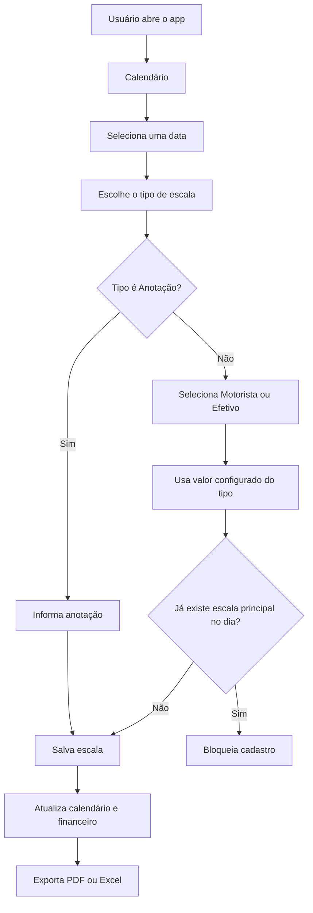

# PRD - Escala Bomba

## Visão geral

Escala Bomba é um aplicativo web/mobile-first para controle pessoal de escalas de bombeiro, com calendário mensal, registro de tipos de plantão, resumo financeiro e exportação de relatórios em PDF e Excel.

## Objetivo

Permitir que o usuário registre rapidamente suas escalas, visualize os dias em calendário, acompanhe valores recebíveis por tipo de escala e gere relatórios mensais.

## Público-alvo

- Bombeiros que precisam controlar escalas extras e plantões.
- Usuários que precisam de um controle offline simples, sem cadastro e sem backend.

## Funcionalidades atuais

- Calendário mensal com navegação entre meses.
- Cadastro de escalas por data.
- Tipos de escala:
  - Delegada
  - DEJEM
  - DEJEM Sazonal
  - Anotação
- Cadastro de valores por tipo financeiro.
- Restrição de uma escala principal por dia: Delegada, DEJEM ou DEJEM Sazonal.
- Delegada, DEJEM e DEJEM Sazonal exigem a seleção de função: Motorista ou Efetivo.
- Permite múltiplos registros do tipo Anotação por dia.
- Edição e exclusão de escalas.
- Filtro por tipo de escala.
- Resumo financeiro por tipo e total geral.
- Agrupamento por mês.
- Exportação em PDF.
- Exportação em Excel.
- Persistência local via `localStorage`.

## Regras de negócio

- Uma data pode ter no máximo uma escala principal: Delegada, DEJEM ou DEJEM Sazonal.
- Escalas principais exigem a função Motorista ou Efetivo.
- O tipo Anotação exige uma informação registrada.
- O tipo Anotação não entra no financeiro e usa valor zero.
- Delegada, DEJEM e DEJEM Sazonal entram no resumo financeiro e nos relatórios.
- Os valores são gravados no momento do cadastro/edição da escala.

## Fluxo principal

## Dados armazenados

O app armazena no navegador:

- `valoresPlantao`: valores configurados para Delegada, DEJEM, DEJEM Sazonal e Anotação.
- `escalas`: lista de escalas com tipo, data, valor, função opcional e anotação opcional.

## Riscos e limitações

- Os dados ficam apenas no dispositivo/navegador.
- Limpar dados do navegador pode apagar os registros.
- Ainda não há autenticação, backup em nuvem ou sincronização entre aparelhos.
- O PWA depende do `index.html` principal registrar manifest e service worker.

## Próximas melhorias recomendadas

- Corrigir e validar a instalação PWA.
- Adicionar tela de backup/importação dos dados.
- Criar testes automatizados para regras de conflito e totais financeiros.
- Permitir relatório filtrado por intervalo de datas.
- Avaliar persistência em backend se houver necessidade de sincronização.
